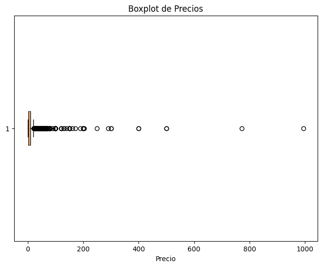
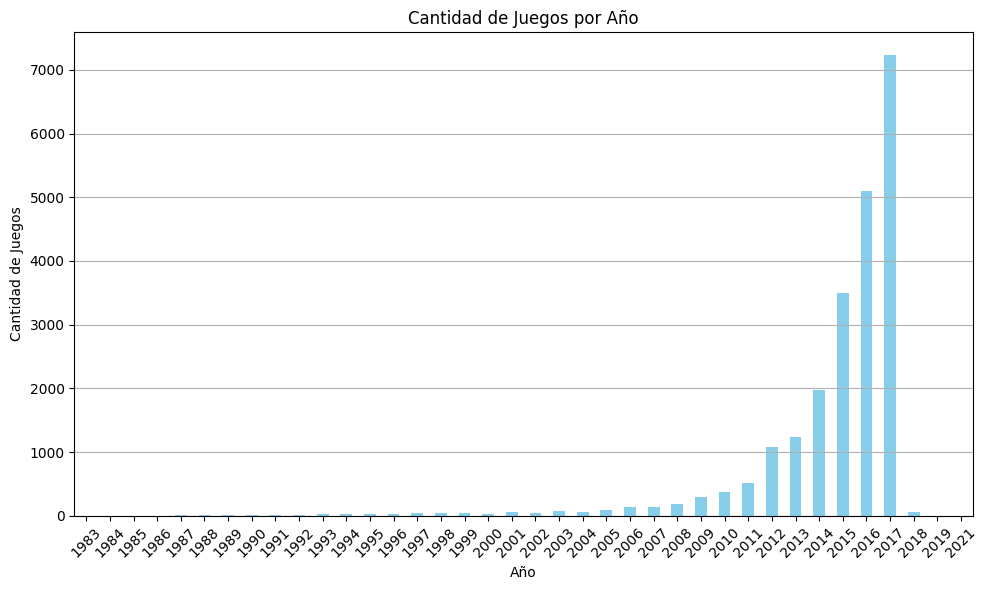
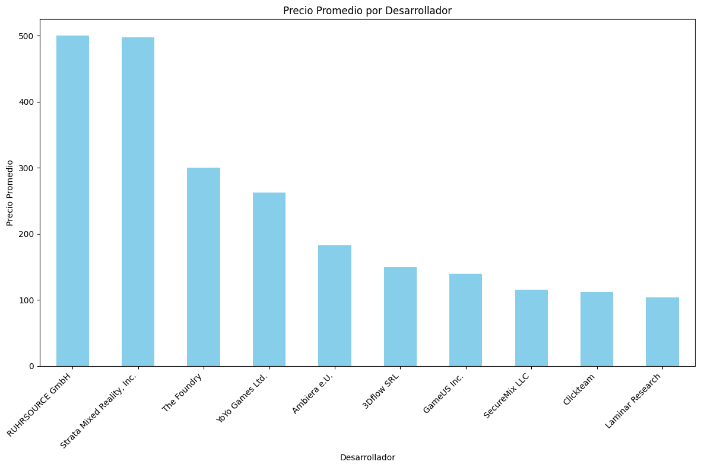
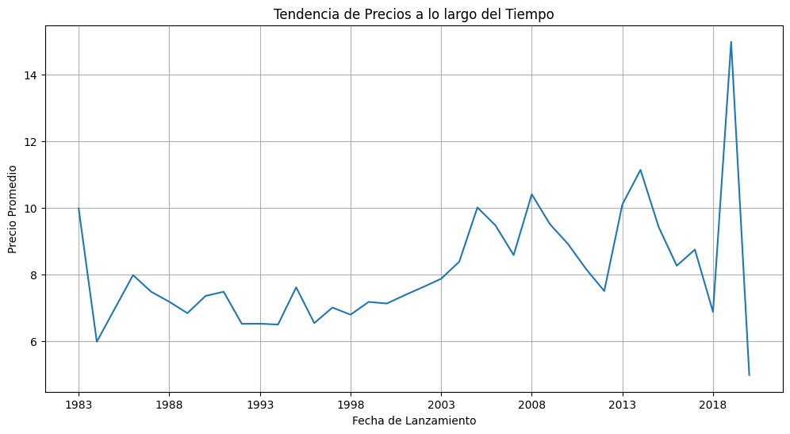

   
# <h1 align=center> **PROYECTO INDIVIDUAL Nº1** </h1>

Machine Learning Operations (MLOps): Sistema de Recomendación de Videojuegos para Usuarios de Steam

### Tegnologías Utilizadas:

## Descripción del Proyecto:

Empezamos a trabajar como Data Scientist en Steam, una plataforma multinacional de videojuegos. Steam pide que nos encarguemos de crear un sistema de recomendación de videojuegos para usuarios.

En este proyecto, trabajamos con tres conjuntos de datos en formato JSON, los cuales presentan una estructura anidada. Debemos extraer información para la creación de un sistema de recomendación a través de un proceso de ETL (Extracción, Transformación y Carga).

## Fuente de datos:

- [Dataset](https://drive.google.com/drive/folders/1HqBG2-sUkz_R3h1dZU5F2uAzpRn7BSpj): Carpeta con el archivo que requieren ser procesados, tengan en cuenta que hay datos que están anidados (un diccionario o una lista como valores en la fila).
- [Diccionario de datos](https://docs.google.com/spreadsheets/d/1-t9HLzLHIGXvliq56UE_gMaWBVTPfrlTf2D9uAtLGrk/edit?usp=drive_link): Diccionario con algunas descripciones de las columnas disponibles en el dataset.: Diccionario con algunas descripciones de las columnas disponibles en el dataset.

## Etapas de Proyecto:

1. ETL (Extracción, Transformación y Carga):

Como primer paso en el proceso de ETL, se crearon dos funciones para poder trabajar con los archivos json que tenían columnas anidadas, para hacer más eficiente el rendimiento de los recursos de la PC.

- Se descargan de manera local los archivos del dataset descriptos anteriormente y con las funciones se leen los archivos 'australian_users_items.json' y 'australian_user_reviews.json'.
- En ambos casos se desanidan las columnas json (reviews e ítems) y se quitan las columnas innecesarias.
- En el caso del archivo 'output_steam_games.json', no fue necesario desanidar columnas, por lo que se procede a leer el archivo de manera convencional. 
- Para finalizar se guardan los dataframes resultantes en csv para continuar con el EDA.

## 2. EDA (Exploratory Data Analysis):

Como segundo paso hicimos un Exploratory data analysis (EDA):

- Lectura de datos: Se leyó el archivo 'output_steam_games.json' utilizando la librería Pandas en Python para cargar los datos en un DataFrame.
- Selección de columnas: Se seleccionaron columnas específicas del DataFrame, incluyendo género, nombre de la aplicación, título, año de lanzamiento, precio, ID de contenido y desarrollador.

En el archivo 'EDA' se evidencian los siguientes procesos:

### Tratamimento de Nulos:

Se encontraron 88310 filas vacias por lo que se eliminaron las mismas quedando un total de 22511 regitros en el dataset

Valores duplicados : se encontraron pocos valores duplicados por lo que se procedio a eliminarlos.
Conclusiones:

### Modificaciones de columnas:

-Se eliminan las columnas 'url','publisher','tags','reviews_url','specs','early_access'
-Se modificó a formato fecha  la columna release_date  para dejar solamente el año de lanzamiento.
-la columna precio se la paso a Float.Se verifica que en la columna precio había otros formatos como ejemplo  Free to Use, Free to Play los cuales se reemplazaron  por 0.00.
-Se renombraron las columnas:'genres':'genero','title':'titulo','release_date':'anio_lanzamiento','price':'precio','id':'id_contenido','developer':'desarrollador'

### Analisis Exploratorio:

- Visualización de la nube de palabras: Se creó una nube de palabras utilizando los géneros de los juegos para visualizar las categorías más comunes en el conjunto de datos.
Se verifican que los generos que resaltan mas son Adventure , Action , Casual e Indie

- Visualización de outliers: Se creó un diagrama de caja para visualizar la distribución de los precios y identificar outliers visualmente.Se verifica valores atipicos que se encuentra en precios superiores a 500.

- Visualización de la distribución de años de lanzamiento: Se creó un histograma para visualizar la distribución de los años de lanzamiento de los juegos en el conjunto de datos.

- Resumen estadístico de las columnas numéricas: Se utilizó la función describe() para obtener un resumen estadístico de las columnas numéricas del DataFrame donde vemos  una media de $8,96 un precio min de 0.00 y un maximo de 995.000 con una desviasion estandar de 15.42

-Se comparó el precio promedio por cada desarrollador y se verifica que los desarrollodares con precios mas caros son Ruhrsource y strata mixed reality.
El juego más caro es: Strata Spaces VR – Professional Edition Upgrade.

Tambien se realizo un analisis se series de tiempo con  la fecha de lanzamiento  para comprender cómo han variado los precios con el tiempo.

Todos los pasos los pueden ver en el Jupyter Notebook 'EDA'.

3. Feature Engineering:

El código hace uso de las siguientes bibliotecas: pandas para la manipulación y análisis de datos, y nltk para el análisis de sentimientos de texto utilizando el algoritmo VADER (Valence Aware Dictionary and sEntiment Reasoner).

El algoritmo VADER proporciona análisis de sentimientos de texto mediante el análisis de la polaridad de las palabras y frases en el texto.

El código define una función de análisis de sentimientos que asigna valores de sentimiento (positivo, neutral o negativo) a las reseñas de usuarios en un DataFrame llamado user_reviews. Luego, aplica esta función a la columna de reseñas, asignando valores de sentimiento basados en la polaridad del texto.

El DataFrame actualizado, que incluye los valores de sentimiento asignados, se guarda en un archivo CSV llamado user_reviews_with_sentiment.csv. Este proceso proporciona una forma de analizar y etiquetar las reseñas de los usuarios en función de su contenido para su posterior procesamiento y análisis.

Todos los pasos los pueden ver en el Jupyter Notebook 'analisis_sentimiento'.

4. Funciones de Consultas:

Todos los pasos los pueden ver en el Jupyter Notebook 'Endpoints'.

### Las funciones para los endpoints que se consumirán en la API son las siguientes:

1. `PlayTimeGenre(genero: str)`: Devuelve el año con más horas jugadas para dicho género.
   - Ejemplo de retorno: {"Año de lanzamiento con más horas jugadas para Género X" : 2013}

2. `UserForGenre(genero: str)`: Devuelve el usuario que acumula más horas jugadas para el género dado y una lista de la acumulación de horas jugadas por año.
   - Ejemplo de retorno: {"Usuario con más horas jugadas para Género X" : us213ndjss09sdf, "Horas jugadas":[{Año: 2013, Horas: 203}, {Año: 2012, Horas: 100}, {Año: 2011, Horas: 23}]}

3. `UsersRecommend(año: int)`: Devuelve el top 3 de juegos MÁS recomendados por usuarios para el año dado.
   - Ejemplo de retorno: [{"Puesto 1" : X}, {"Puesto 2" : Y},{"Puesto 3" : Z}]

4. `UsersNotRecommend(año: int)`: Devuelve el top 3 de juegos MENOS recomendados por usuarios para el año dado.
   
5. `sentiment_analysis(año: int)`: Según el año de lanzamiento, se devuelve una lista con la cantidad de registros de reseñas de usuarios que se encuentren categorizados con un análisis de sentimiento.
   - Ejemplo de retorno: {Negative = 182, Neutral = 120, Positive = 278}

# API:

Se Muestran Deployadas las siguientes Funciones y el sistema de Recomendación:

### def PlayTimeGenre( genero : str ): Debe devolver año con mas horas jugadas para dicho género.
Ejemplo de retorno: {"Año de lanzamiento con más horas jugadas para Género X" : 2013}

### def UserForGenre( genero : str ): Debe devolver el usuario que acumula más horas jugadas para el género dado y una lista de la acumulación de horas jugadas por año.
Ejemplo de retorno: {"Usuario con más horas jugadas para Género X" : us213ndjss09sdf, "Horas jugadas":[{Año: 2013, Horas: 203}, {Año: 2012, Horas: 100}, {Año: 2011, Horas: 23}]}

### Sistema de recomendación item-item:

def recomendacion_juego( id de producto ): Ingresando el id de producto, deberíamos recibir una lista con 5 juegos recomendados similares al ingresado.

# Ruta del Deploy de la API: 

# VIDEO

Ruta del Deploy de la API: 

Gracias por la Visita!!

Disponible a Consultas

  
  

